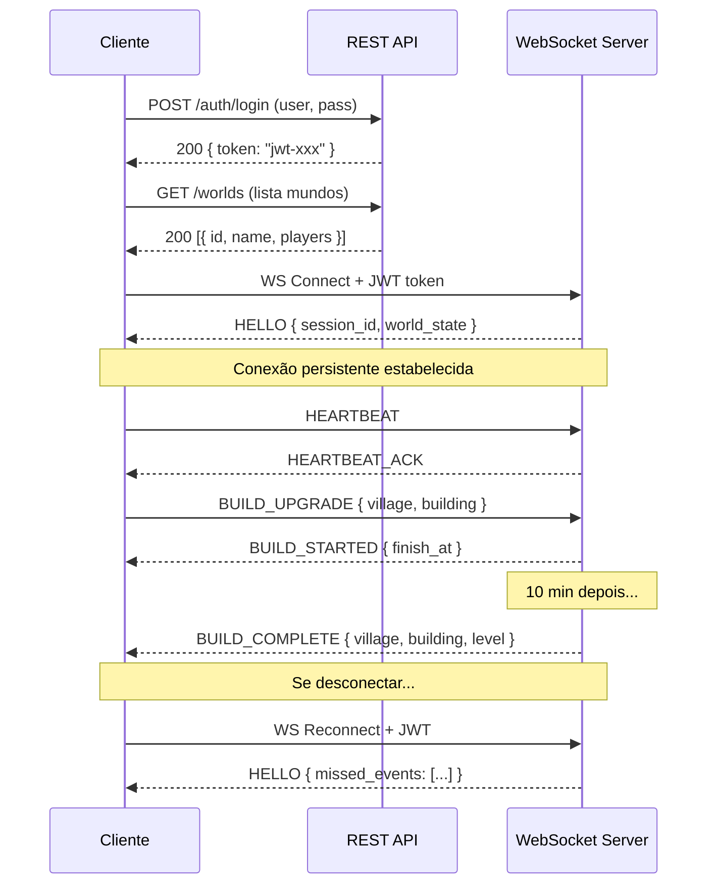

# 🌐 Análise de Protocolos — RTS MMO

## TL;DR — Recomendação

**Use WebSocket como protocolo principal + REST apenas para operações fora do jogo.**

| Cenário | Protocolo | Motivo |
|---------|-----------|--------|
| Gameplay em tempo real | **WebSocket** | Bidirecional, baixa latência, persistent connection |
| Login, registro, lobby | **REST** | Stateless, simples, cacheable |
| Admin panel, rankings públicos | **REST** | Não precisa de conexão persistente |

> [!IMPORTANT]
> Para um jogo estilo Tribal Wars, **WebSocket é inegociável** para o gameplay. A questão real é: usar REST ou gRPC para o resto?

---

## Análise Detalhada

### 1. WebSocket ⭐ (Protocolo Principal do Jogo)

**Por que é essencial para o gameplay:**

```
Servidor ──push──► Cliente
   "Ataque chegando em 3:42"
   "Recursos atualizados"
   "Chat da tribo"
   "Village conquistada"
   "Tropa retornou"
```

| Ponto | Detalhe |
|-------|---------|
| ✅ **Bidirecional** | Cliente envia comandos, servidor envia eventos — na mesma conexão |
| ✅ **Push do servidor** | Notificações em tempo real sem polling |
| ✅ **Baixa latência** | Sem overhead de HTTP por mensagem (após handshake) |
| ✅ **Conexão persistente** | Uma vez conectado, mantém o canal aberto |
| ✅ **Baixo overhead** | Frame de ~2-6 bytes vs ~800+ bytes de HTTP headers |
| ⚠️ **Stateful** | Precisa gerenciar conexões ativas (mais complexo no servidor) |
| ⚠️ **Reconexão** | Precisa implementar lógica de retry + sync de estado |

**Eventos que PRECISAM de push (impossível com REST puro):**

```
┌─────────────────────────────────────────────────────┐
│  EVENTOS DO SERVIDOR → CLIENTE                       │
├─────────────────────────────────────────────────────┤
│  • Ataque inimigo detectado (countdown)              │
│  • Tropas retornaram à village                       │
│  • Construção finalizada                             │
│  • Mensagem de chat (tribo/global)                   │
│  • Village conquistada/perdida                       │
│  • Alianças declaradas/quebradas                     │
│  • Relatório de batalha disponível                   │
│  • Suporte aliado chegou                             │
│  • Oferta no mercado aceita                          │
└─────────────────────────────────────────────────────┘

┌─────────────────────────────────────────────────────┐
│  COMANDOS DO CLIENTE → SERVIDOR                      │
├─────────────────────────────────────────────────────┤
│  • Iniciar construção/upgrade                        │
│  • Recrutar tropas                                   │
│  • Enviar ataque/suporte                             │
│  • Enviar mensagem de chat                           │
│  • Criar oferta no mercado                           │
│  • Cancelar comando de tropas                        │
│  • Renomear village                                  │
└─────────────────────────────────────────────────────┘
```

---

### 2. REST API (Complementar — fora do gameplay)

**Usar para:**
- Login / Registro / Autenticação (gera token JWT)
- Seleção de mundo (lobby)
- Rankings públicos (cacheable com CDN)
- Admin panel
- Webhooks externos

**NÃO usar para gameplay porque:**

```
❌ Polling a cada 1s para verificar ataques:
   Cliente → GET /api/attacks/incoming → 200 []     ← vazio
   Cliente → GET /api/attacks/incoming → 200 []     ← vazio
   Cliente → GET /api/attacks/incoming → 200 []     ← vazio (100x por jogador)
   
   1000 jogadores × 1 req/s = 1000 req/s só para ataques
   + recursos, chat, construções = 4000+ req/s de NADA

✅ WebSocket:
   Servidor → Cliente: { "event": "attack_incoming", ... }  ← só quando acontece
   
   Custo = ZERO quando não há eventos
```

---

### 3. gRPC — Por que NÃO recomendo como principal

| Ponto | Detalhe |
|-------|---------|
| ✅ Typesafe + codegen | Proto files geram DTOs automaticamente |
| ✅ Streaming bidirecional | Poderia substituir WebSocket |
| ✅ Excelente performance | Serialização binária (protobuf) |
| ❌ **Suporte no browser** | Precisa de gRPC-Web proxy (Envoy) — complexidade extra |
| ❌ **Debugging difícil** | Binário = não dá pra inspecionar no DevTools |
| ❌ **Overkill para este caso** | Tribal Wars não é FPS — não precisa de microsegundos de latência |
| ❌ **Infraestrutura extra** | Proxy, load balancer com HTTP/2 support, etc. |

> [!WARNING]
> gRPC brilha em comunicação **server-to-server** (microservices). Para **client-to-server** em jogos browser-based, WebSocket é mais natural e simples.
>
> **Exceção**: se seu cliente for **Unity/C# nativo** (desktop/mobile), gRPC se torna mais viável porque não tem a limitação do browser.

---

## 🏗️ Arquitetura Recomendada

```
                    ┌─────────────────────────────────────────┐
                    │              CLIENTE                     │
                    │         (Browser / App)                  │
                    └──────┬──────────────┬───────────────────┘
                           │              │
                    HTTP/REST        WebSocket
                    (stateless)      (persistent)
                           │              │
                    ┌──────▼──────┐  ┌────▼────────────────┐
                    │  REST API   │  │   Game WebSocket     │
                    │             │  │      Server          │
                    │ • Login     │  │                      │
                    │ • Register  │  │ • Gameplay commands  │
                    │ • Lobby     │  │ • Real-time events   │
                    │ • Rankings  │  │ • Chat               │
                    │ • Admin     │  │ • Notifications      │
                    └──────┬──────┘  └────┬────────────────┘
                           │              │
                    ┌──────▼──────────────▼────────────────┐
                    │          SHARED BACKEND               │
                    │    (Game Logic / Database / Cache)     │
                    └──────────────────────────────────────┘
```

---

## 📡 Protocolo do WebSocket — Estrutura de Mensagens

Use um formato simples de mensagens com **opcode + payload**:

### Formato da mensagem
```
┌──────────┬────────────┬─────────────────────────┐
│  opcode  │  payload   │     descrição            │
│  (byte)  │  (bytes)   │                          │
└──────────┴────────────┴─────────────────────────┘
```

### Exemplo com JSON (mais fácil de debugar):
```json
// Cliente → Servidor
{
  "op": 10,
  "d": {
    "village_id": "uuid-123",
    "building_type": 1,
  }
}

// Servidor → Cliente
{
  "op": 50,
  "d": {
    "attacker": "PlayerX",
    "target_village_id": "uuid-456",
    "arrival_at": "2026-03-26T18:30:00Z",
    "troop_count": 150
  }
}
```

### Opcodes sugeridos
```
// Client → Server (0-49)
 1 = HEARTBEAT (keep-alive)
10 = BUILD_UPGRADE
11 = RECRUIT_TROOPS
12 = SEND_ATTACK
13 = SEND_SUPPORT
14 = CANCEL_COMMAND
15 = CHAT_MESSAGE
16 = MARKET_OFFER

// Server → Client (50-99)
51 = HEARTBEAT_ACK
50 = ATTACK_INCOMING
52 = TROOPS_RETURNED
53 = BUILD_COMPLETE
54 = VILLAGE_CONQUERED
55 = CHAT_MESSAGE
56 = BATTLE_REPORT
57 = RESOURCE_UPDATE
58 = MARKET_ACCEPTED
```

> [!TIP]
> **JSON vs MessagePack/Protobuf para o payload:**
> - Comece com **JSON** — mais fácil de debugar no início do desenvolvimento
> - Migre para **MessagePack** quando precisar de performance — você já tem experiência com isso (vi nas suas conversas anteriores)
> - A troca é transparente se o `opcode` ficar separado do payload

---

## ⚡ MessagePack como Upgrade Futuro

Dado que você já trabalhou com MessagePack no seu backend .NET, considere esta evolução:

```
Fase 1 (desenvolvimento): JSON payload
  → Fácil de debugar com DevTools
  → Mais rápido de iterar

Fase 2 (produção): MessagePack payload
  → 30-50% menor que JSON
  → Parsing mais rápido
  → Já familiar para você
```

---

## 🔄 Ciclo de Vida da Conexão



> [!IMPORTANT]
> **Missed events**: Quando o jogador reconecta, o servidor deve enviar os eventos que ele perdeu enquanto estava offline. Armazene eventos recentes em Redis/cache com TTL de ~5 minutos.

---

## ✅ Resumo da Decisão

| Critério | REST | WebSocket | gRPC |
|----------|------|-----------|------|
| Push do servidor | ❌ | ✅ | ✅ |
| Browser support nativo | ✅ | ✅ | ❌ (precisa proxy) |
| Debugging fácil | ✅ | ✅ | ❌ |
| Overhead por mensagem | Alto (~800B) | Baixo (~6B) | Baixo (~20B) |
| Conexão persistente | ❌ | ✅ | ✅ |
| Complexidade | Baixa | Média | Alta |
| **Veredicto para RTS MMO** | **Complementar** | **Principal** | **Desnecessário** |

**Resposta final**: **WebSocket** para gameplay + **REST** para auth/lobby/admin. Sem gRPC (a menos que tenha microservices internos no backend).
