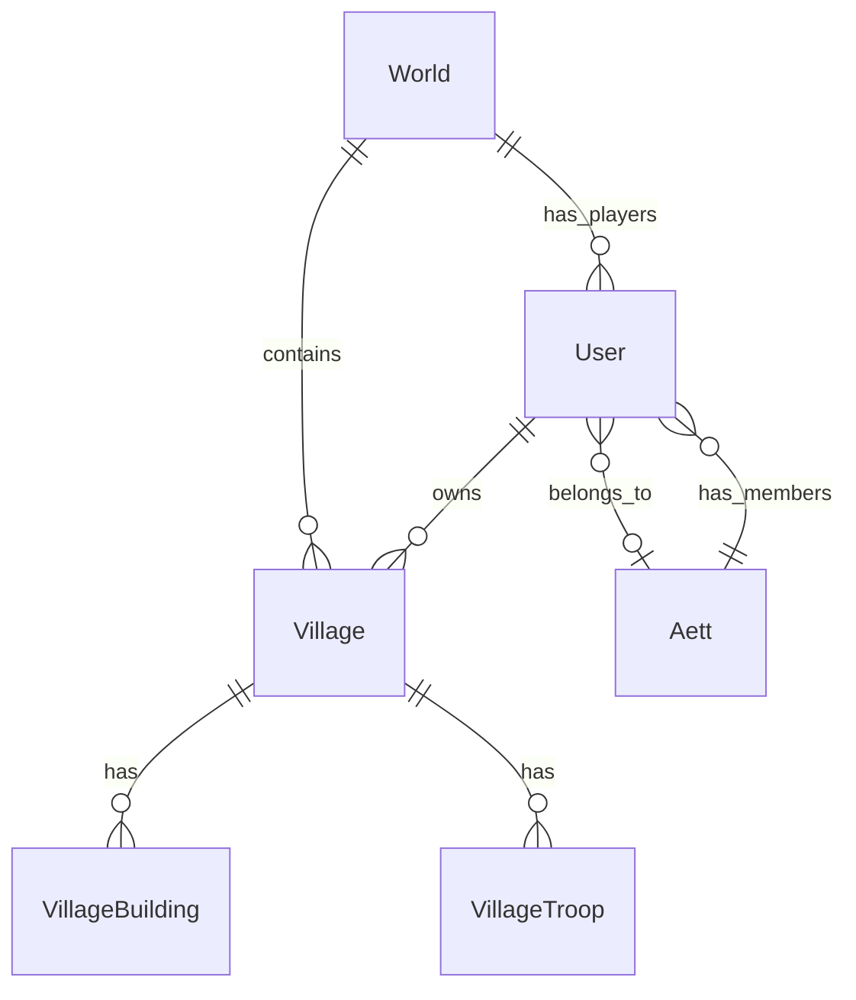
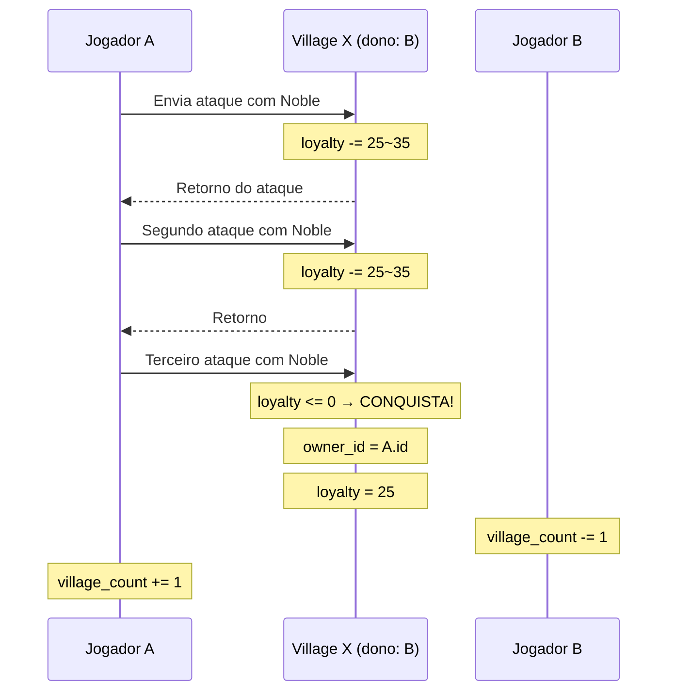

# 🏰 Modelo de Dados — RTS MMO (Tribal Wars-like)

## Visão Geral das Entidades



---

## 📋 Entidades Atuais (revisadas)

### World
Sem grandes mudanças, está bem modelada.

| Campo | Tipo | Descrição |
|-------|------|-----------|
| id | UUID | PK |
| capacity | ushort | Max jogadores |
| bot_count | ushort | Quantidade de bots |
| wild_villages | ushort | Villages sem dono (bárbaras) |
| server_type | byte | Tipo do servidor (speed, casual, etc.) |
| win_condition | byte | Condição de vitória |
| speed_modifier | float | ⭐ Multiplicador de velocidade do mundo |
| created_at | dateTime | ⭐ Quando o mundo foi criado |

### User
| Campo | Tipo | Descrição |
|-------|------|-----------|
| id | UUID | PK |
| world_id | UUID | ⭐ FK → World (um user por mundo) |
| username | char[] | Nome do jogador |
| aett_id | UUID | FK → Aett (nullable) |
| emblem_index | byte | Ícone/avatar do jogador |
| total_points | uint | ⭐ Soma da pontuação de todas as villages |
| village_count | ushort | ⭐ Cache: quantas villages possui |
| created_at | dateTime | Data de criação |

> [!TIP]
> `total_points` e `village_count` são campos **desnormalizados** (cache). São atualizados quando uma village muda de dono ou evolui. Isso evita fazer `SUM()` / `COUNT()` em queries de ranking, que seriam caríssimas em um MMO.

### Aett (Tribo/Clã)
| Campo | Tipo | Descrição |
|-------|------|-----------|
| id | UUID | PK |
| world_id | UUID | ⭐ FK → World |
| aett_name | char[] | Nome da tribo |
| leader_id | UUID | FK → User |
| emblem_index | byte | Emblema da tribo |
| member_count | ushort | ⭐ Cache: total de membros |
| total_points | uint | ⭐ Cache: soma dos pontos dos membros |
| created_at | dateTime | Data de criação |

> [!IMPORTANT]
> Removi `member_ids: UUID[]` — armazenar arrays de IDs dentro da entidade é um anti-pattern. A relação já está modelada pelo campo `aett_id` no `User`. Se precisar listar membros, basta fazer query: `WHERE aett_id = X`.

---

## 🏘️ Village — A Entidade Central

Esta é a entidade mais importante e a que mais precisa de atenção.

### Village (entidade principal)
| Campo | Tipo | Descrição |
|-------|------|-----------|
| id | UUID | PK |
| world_id | UUID | FK → World |
| owner_id | UUID | FK → User (**nullable** — null = village bárbara) |
| name | char[] | Nome da village (customizável) |
| x | short | Coordenada X no mapa |
| y | short | Coordenada Y no mapa |
| points | uint | Pontuação total da village |
| loyalty | byte | Lealdade (100 = máx, ao chegar em 0 é conquistada) |
| last_updated_at | dateTime | Último tick de atualização de recursos |
| created_at | dateTime | Data de criação |

> [!NOTE]
> **Village bárbara (wild)**: quando `owner_id = null`, é uma village sem dono que qualquer jogador pode conquistar. Quando um jogador perde todas as villages, ele sai do jogo e suas villages se tornam bárbaras (ou são removidas).

### Porque `owner_id` nullable é a melhor abordagem

```
Jogador A conquista Village X:
  → Village X.owner_id = User A.id
  → Village X.loyalty = 100

Jogador B conquista Village X de A:
  → Village X.owner_id = User B.id  (simplesmente troca o FK)
  → Village X.loyalty = 100
  → User A.village_count -= 1
  → User B.village_count += 1
```

Não precisa de tabela de junção `UserVillage` — a relação é **1:N** simples (um user tem muitas villages, uma village tem no máximo um dono).

---

## 🏗️ Buildings — Composição por Entidade Separada

### Abordagem recomendada: `VillageBuilding`

| Campo | Tipo | Descrição |
|-------|------|-----------|
| village_id | UUID | PK, FK → Village |
| building_type | byte | PK, Enum do tipo de construção |
| level | byte | Nível atual (0 = não construído) |
| is_upgrading | bool | Se está em upgrade |
| upgrade_finish_at | dateTime | Quando o upgrade termina (nullable) |

**Chave primária composta**: `(village_id, building_type)`

### BuildingType (enum)
```
0  = JarlsHall           (Jarl's Hall — City Center)
1  = FreyjasTemple       (Freyja's Temple — Divine Worship)
2  = BerserkersBarrack   (Berserker's Barrack — Troop Training)
3  = DrakkarShipyard     (Drakkar Shipyard — Ship Construction)
4  = ExplorersHouse      (Explorer's House — Exploration & Espionage)
5  = EldrunarsCave       (Eldrunar's Cave — Metal & Magical Resource)
6  = RunicSanctuary      (Runic Sanctuary — Research & Magic Upgrades)
7  = StorageAndMarket    (Storage & Market — Resource Management)
8  = SacredHarvestField  (Sacred Harvest Field — Food Production)
9  = WatchTower          (Watch Tower — Defense & Alert)
10 = VidarsWoodland      (Víðarr's Woodland — Wood Production)
11 = DvergrsQuarry       (Dvergr's Quarry — Rock Production)
```

> [!TIP]
> **Por que entidade separada em vez de colunas fixas na Village?**
> - Se você colocar `barracks_level`, `stable_level`, `wall_level` como colunas no Village, fica rígido. Adicionar um prédio novo = alterar schema.
> - Com `VillageBuilding`, adicionar um prédio novo é apenas um novo valor no enum. Zero migração de schema.
> - A query `WHERE village_id = X` retorna todos os buildings de uma vez, com performance excelente.

---

## ⚔️ Troops — Mesma Lógica

### VillageTroop

| Campo | Tipo | Descrição |
|-------|------|-----------|
| village_id | UUID | PK, FK → Village |
| troop_type | byte | PK, Enum do tipo de tropa |
| quantity | ushort | Quantidade estacionada na village |

**Chave primária composta**: `(village_id, troop_type)`

### TroopType (enum)
```
// 🟢 Basic (Berserker's Barrack Lv 1–5)
0  = Spearman         (Lanceiro — Ground, Melee, Defensive)
1  = Viking           (Viking — Ground, Melee, Offensive)
2  = Bowman           (Arqueiro — Ground, Ranged, Offensive)

// 🔵 Advanced (Berserker's Barrack Lv 10–20 + Research)
3  = Shieldmaiden     (Donzela do Escudo — Ground, Melee, Defensive)
4  = Berserker        (Berserker — Ground, Melee, Offensive)
5  = Huntsman         (Rastreador — Ground, Ranged, Offensive)
6  = Cavaleiro        (Riddari — Ground, Melee, Mixed)

// 🟣 Elite (Berserker's Barrack Lv 25–35 + Advanced Research)
7  = Huskarl          (Huskarl — Ground, Melee, Defensive)
8  = Jomsviking       (Jomsviking — Ground, Melee, Offensive)
9  = Ulfhednar        (Guerreiro-Lobo — Ground, Melee, Offensive)
10 = Runecaster       (Lançador de Runas — Ground, Ranged, Mixed)

// 🟡 Mythological (Freyja's Temple + Deity + Eldrunar)
11 = Valkyrie         (Valquíria — Flying, Melee, Mixed · Deity: Freyja)
12 = FrostGiant       (Jötunn — Ground, Melee, Offensive/Siege · Deity: Skadi)
13 = RavenOfOdin      (Huginn — Flying, Ranged, Offensive)
14 = Einherjar        (Einherjar — Ground, Melee, Mixed · Deity: Tyr)
```

> [!IMPORTANT]
> Tropas que estão **em movimento** (ataque, suporte, retorno) **não devem ficar nesta tabela**. Elas devem estar numa entidade de `Command` / `March` separada (ver abaixo).

---

## 🗺️ Entidades de Suporte (futuro próximo)

Estas entidades serão necessárias conforme o jogo evolui:

### Command (Movimentação de Tropas)
```
Command
├── id: UUID
├── type: byte              (attack, support, return, scout)
├── origin_village_id: UUID
├── target_village_id: UUID
├── owner_id: UUID
├── departure_at: dateTime
├── arrival_at: dateTime
├── troops: CommandTroop[]  (tipo + quantidade)
└── status: byte            (traveling, returning, arrived)
```

### VillageResources (embutido no Village ou separado)
```
VillageResources
├── village_id: UUID
├── wood: uint
├── clay: uint
├── iron: uint
└── last_calculated_at: dateTime   ← lazy calculation
```

> [!TIP]
> **Lazy Resource Calculation**: Não atualize recursos a cada segundo. Armazene o timestamp da última atualização e calcule os recursos sob demanda: `current_resources = stored + (production_rate × elapsed_time)`. Isso é essencial para escalar um MMO.

---

## 🎯 Fluxo de Conquista



---

## 📊 Cálculo de Pontuação

A pontuação de uma **Village** é a soma dos pontos de todos os buildings:

```
village.points = Σ building_points[building_type][level]
```

Exemplo de tabela de pontos (dados de configuração, não no banco):
| Building | Lvl 1 | Lvl 2 | Lvl 3 | ... | Lvl 30 |
|----------|-------|-------|-------|-----|--------|
| HQ | 10 | 12 | 15 | ... | 1200 |
| Barracks | 16 | 20 | 24 | ... | 1800 |
| Wall | 8 | 10 | 12 | ... | 900 |

A pontuação do **User** é soma de todas as suas villages:
```
user.total_points = Σ village.points WHERE owner_id = user.id
```

---

## 🔑 Resumo da Estrutura Final

```mermaid
erDiagram
    World {
        UUID id PK
        ushort capacity
        ushort bot_count
        ushort wild_villages
        byte server_type
        byte win_condition
        float speed_modifier
    }

    User {
        UUID id PK
        UUID world_id FK
        string username
        UUID aett_id FK
        byte emblem_index
        uint total_points
        ushort village_count
    }

    Aett {
        UUID id PK
        UUID world_id FK
        string aett_name
        UUID leader_id FK
        byte emblem_index
        ushort member_count
        uint total_points
    }

    Village {
        UUID id PK
        UUID world_id FK
        UUID owner_id FK
        string name
        short x
        short y
        uint points
        byte loyalty
    }

    VillageBuilding {
        UUID village_id PK_FK
        byte building_type PK
        byte level
        bool is_upgrading
        dateTime upgrade_finish_at
    }

    VillageTroop {
        UUID village_id PK_FK
        byte troop_type PK
        ushort quantity
    }

    World ||--o{ User : "has players"
    World ||--o{ Village : contains
    World ||--o{ Aett : has
    User ||--o{ Village : owns
    User }o--o| Aett : "member of"
    Village ||--o{ VillageBuilding : has
    Village ||--o{ VillageTroop : has
```

---

## ✅ Decisões Chave

| Decisão | Justificativa |
|---------|--------------|
| `owner_id` nullable no Village | Village bárbara = sem dono. Conquista = troca de FK. Simples e eficiente |
| Buildings como entidade separada | Flexibilidade para adicionar prédios sem alterar schema |
| Troops como entidade separada | Mesma razão. Tropas em movimento ficam em `Command` |
| Campos desnormalizados (points, counts) | Performance de ranking. Essencial para MMO |
| Sem `member_ids[]` no Aett | Anti-pattern. A relação inversa (`user.aett_id`) já resolve |
| Lazy resource calculation | Escalabilidade — não atualizar recursos em tempo real |
