# 🎮 Fluxo de Onboarding — Login até o Jogo

## Fluxograma Completo

```mermaid
flowchart TD
    START([🎮 Jogador abre o app]) --> HAS_ACCOUNT{Tem conta?}

    %% ── Auth ──
    HAS_ACCOUNT -->|Sim| LOGIN[1. Login<br/>Email + Senha]
    HAS_ACCOUNT -->|Não| REGISTER[1.1 Registrar<br/>Email + Senha + Username]
    REGISTER --> AUTO_LOGIN[Login automático]
    AUTO_LOGIN --> WORLD_SELECT
    LOGIN --> WORLD_SELECT

    %% ── World Selection ──
    WORLD_SELECT[2. Selecionar um Mundo<br/>Lista de mundos disponíveis]
    WORLD_SELECT --> HAS_VILLAGE{Já tem village<br/>nesse mundo?}

    HAS_VILLAGE -->|Sim| LOAD_GAME[Carregar village<br/>existente]
    LOAD_GAME --> GAME

    HAS_VILLAGE -->|Não| JOIN_WORLD[2.1 Iniciar em<br/>novo mundo]
    JOIN_WORLD --> CREATE_VILLAGE[Criar village inicial<br/>posição aleatória no mapa]
    CREATE_VILLAGE --> PRESENTATION

    %% ── Tutorial Flow ──
    PRESENTATION[3. Apresentação<br/>Introdução ao mundo / lore]
    PRESENTATION --> TUT_BUILD[3.1 Tutorial de Construção<br/>Construir primeiro edifício]
    TUT_BUILD --> TUT_NAME[3.2 Dar nome à cidade]
    TUT_NAME --> TUT_RECRUIT[4. Tutorial de Recrutamento<br/>Recrutar primeiras tropas]
    TUT_RECRUIT --> TUT_ATTACK[5. Tutorial de Ataque<br/>Atacar village bárbara]
    TUT_ATTACK --> TUT_DEFENSE[6. Tutorial de Defesa<br/>Configurar defesas / muralha]
    TUT_DEFENSE --> TUT_QUESTS[7. Tutorial de Quests<br/>Completar primeira quest]
    TUT_QUESTS --> TUT_DIVINITY[8. Tutorial de Divindade<br/>Escolher / ativar divindade]
    TUT_DIVINITY --> CHECK_BONUS

    %% ── First Experience Bonus ──
    CHECK_BONUS{9. Já recebeu<br/>First Experience<br/>Bonus?}
    CHECK_BONUS -->|Não, é a primeira vez| GIVE_BONUS[🎁 Entregar First<br/>Experience Bonus<br/>Marcar flag no User]
    CHECK_BONUS -->|Sim, já recebeu<br/>em outro mundo| SKIP_BONUS[Pular bonus]
    
    GIVE_BONUS --> GAME
    SKIP_BONUS --> GAME

    %% ── Game ──
    GAME([✅ ENTRAR NO JOGO<br/>Conectar WebSocket<br/>Carregar game state])

    %% ── Styling ──
    style START fill:#1a1a2e,stroke:#e94560,color:#fff
    style GAME fill:#0f3460,stroke:#16c79a,color:#fff,stroke-width:3px
    style REGISTER fill:#1a1a2e,stroke:#e94560,color:#fff
    style LOGIN fill:#1a1a2e,stroke:#e94560,color:#fff
    style GIVE_BONUS fill:#0f3460,stroke:#f5c518,color:#fff,stroke-width:2px
    style CHECK_BONUS fill:#162447,stroke:#f5c518,color:#fff
    style HAS_ACCOUNT fill:#162447,stroke:#e94560,color:#fff
    style HAS_VILLAGE fill:#162447,stroke:#e94560,color:#fff
```



---

## 📋 Detalhamento de Cada Etapa

### 1. Autenticação (REST API)

| Etapa | Endpoint | Detalhes |
|-------|----------|---------|
| Login | `POST /auth/login` | Email + senha → retorna JWT |
| Registro | `POST /auth/register` | Email + senha + username → cria User → retorna JWT |

Após autenticação, o jogador recebe um **JWT token** que será usado tanto no REST quanto na conexão WebSocket.

---

### 2. Seleção de Mundo (REST API)

| Etapa | Endpoint | Detalhes |
|-------|----------|---------|
| Listar mundos | `GET /worlds` | Retorna mundos com status, jogadores ativos, velocidade |
| Verificar participação | `GET /worlds/{id}/me` | Retorna se user já tem village nesse mundo |
| Entrar em mundo novo | `POST /worlds/{id}/join` | Cria village inicial, posição aleatória |

**Decisão chave aqui:**
```
Se jogador JÁ TEM village no mundo selecionado:
  → Pula direto para o jogo (sem tutorial)
  → Carrega o estado da village existente

Se jogador é NOVO nesse mundo:
  → Cria village inicial
  → Inicia fluxo de tutorial
```

---

### 3-8. Tutoriais (WebSocket — dentro do jogo)

Os tutoriais acontecem **dentro do jogo**, com a conexão WebSocket já ativa:

| # | Tutorial | O que acontece | Reward |
|---|----------|---------------|--------|
| 3 | Apresentação | Lore / contexto do mundo | — |
| 3.1 | Construção | Guiado a fazer upgrade do HQ | Recursos |
| 3.2 | Nomear cidade | Input de nome customizado | — |
| 4 | Recrutamento | Recrutar 5 lanceiros | Tropas extras |
| 5 | Ataque | Atacar village bárbara próxima | Recursos saqueados |
| 6 | Defesa | Construir muralha / posicionar defesa | Recursos |
| 7 | Quests | Abrir painel de quests, completar 1 | Reward da quest |
| 8 | Divindade | Escolher divindade inicial | Buff ativo |

> [!IMPORTANT]
> Os tutoriais devem ser **skipáveis** (para jogadores experientes que entram em um mundo novo), mas o progresso deve ser salvo para que o jogador retome de onde parou caso desconecte no meio.

---

### 9. First Experience Bonus

```
Flag global no User (NÃO no UserWorld):

User {
  ...
  has_claimed_first_bonus: bool   ← campo GLOBAL
}
```

**Regra:**
- Na **primeira vez** que o jogador completa o tutorial em **qualquer mundo** → recebe o bonus
- Se entrar em um **segundo mundo** depois → completa tutorial mas **NÃO recebe** o bonus de novo
- O bonus é generoso (recursos extras, speedup, etc.) para reter o jogador nas primeiras horas

---

## 🗄️ Modelo de Dados — Flags de Tutorial

Para controlar o progresso do tutorial **por mundo**, adicione ao modelo:

```
UserWorld (relação User ↔ World)
├── user_id: UUID          PK, FK
├── world_id: UUID         PK, FK
├── tutorial_step: byte    (0-8, qual tutorial está / completou)
├── tutorial_completed: bool
├── joined_at: dateTime
└── is_active: bool
```

```
User (campo global)
├── ...
├── has_claimed_first_bonus: bool    ← global, não por mundo
└── ...
```

> [!NOTE]
> `tutorial_step` permite que o jogador **retome** o tutorial do ponto exato onde parou. Se ele desconectar no tutorial 5 (ataque), quando reconectar, o jogo sabe que deve continuar do passo 5.

---

## 🔄 Fluxo Simplificado (Visão Rápida)

```
Abrir App
  │
  ├─ Não tem conta? → Registrar → Login automático
  │
  └─ Tem conta? → Login
        │
        └─ Selecionar Mundo
              │
              ├─ Já tem village? → Carregar → JOGAR
              │
              └─ Mundo novo? → Criar village
                    │
                    └─ Tutorial (3→3.1→3.2→4→5→6→7→8)
                          │
                          └─ First bonus? (1x por user)
                                │
                                └─ JOGAR
```
