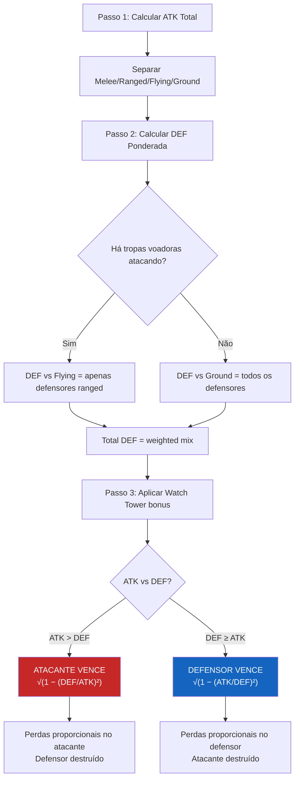

# ⚔️ Ironfrost Sagas — Battle Algorithm

> Sistema de resolução de combate auto-resolvido (server-side), inspirado em Tribal Wars / Grépolis e adaptado para suportar as mecânicas únicas do Ironfrost Sagas: **melee vs ranged**, **unidades voadoras** e **sistema de counter**.

---

## Conceito Fundamental

As batalhas em Ironfrost Sagas são **auto-resolvidas instantaneamente** no servidor. O jogador não controla as tropas durante o combate — ele toma decisões estratégicas **antes** (composição do exército, alvo do ataque). O algoritmo determina o vencedor e as perdas de ambos os lados.

A base matemática é a **Lei Quadrática de Lanchester**, usada em jogos como Tribal Wars:

```
Se ATK > DEF → Atacante VENCE
  Sobrevivência do atacante = √(1 − (DEF/ATK)²)
  Todas as tropas do defensor são destruídas.

Se DEF ≥ ATK → Defensor VENCE
  Sobrevivência do defensor = √(1 − (ATK/DEF)²)
  Todas as tropas do atacante são destruídas.
```

> **Por que Lanchester?** A fórmula cria uma curva onde vitórias esmagadoras resultam em poucas perdas, enquanto batalhas apertadas são devastadoras para ambos os lados. Isto incentiva atacar apenas quando se tem vantagem significativa.

---

## Algoritmo — Passo a Passo

### Passo 1: Calcular Poder de Ataque Total

```
Total_ATK = Σ (tropa_i.ATK × quantidade_i)
```

Separar em:
- `Melee_ATK` = ATK vindo de tropas melee
- `Ranged_ATK` = ATK vindo de tropas ranged
- `melee_prop` = Melee_ATK / Total_ATK
- `ranged_prop` = Ranged_ATK / Total_ATK

E também:
- `Flying_ATK` = ATK de tropas voadoras
- `Ground_ATK` = ATK de tropas terrestres
- `flying_prop` = Flying_ATK / Total_ATK
- `ground_prop` = Ground_ATK / Total_ATK

### Passo 2: Calcular Poder de Defesa Total

Cada defensor usa uma **defesa ponderada** baseada na composição do ataque:

```
DEF_efetiva_i = (melee_prop × DEF_M_i) + (ranged_prop × DEF_R_i)
```

Para a **porção terrestre** do ataque (todos os defensores contribuem):
```
DEF_vs_Ground = Σ (DEF_efetiva_ground_i × quantidade_i)   [todos os defensores]
```

Para a **porção voadora** do ataque (APENAS defensores ranged contribuem):
```
DEF_vs_Flying = Σ (DEF_efetiva_flying_i × quantidade_i)   [somente tropas ranged]
```

> ⚠️ **Regra do Voo:** Tropas terrestres melee NÃO PODEM alvejar unidades voadoras. Apenas tropas ranged (Bowman, Huntsman, Runecaster) contribuem defesa contra a porção voadora do ataque.

Combinar:
```
Total_DEF_base = (ground_prop × DEF_vs_Ground) + (flying_prop × DEF_vs_Flying)
```

### Passo 3: Aplicar Bônus de Muralha (Watch Tower)

```
wall_modifier = 1 + (WatchTowerLevel × 0.05)
base_wall_DEF  = WatchTowerLevel × 50

Total_DEF = (Total_DEF_base × wall_modifier) + base_wall_DEF
```

| Watch Tower | Multiplicador | DEF Base |
|:-----------:|:------------:|:--------:|
| 0 | 1.00× | 0 |
| 5 | 1.25× | 250 |
| 10 | 1.50× | 500 |
| 15 | 1.75× | 750 |
| 20 | 2.00× | 1,000 |

### Passo 4: Resolução (Lanchester)

```
Se Total_ATK > Total_DEF:
  → ATACANTE VENCE
  → taxa_sobrevivência = √(1 − (Total_DEF / Total_ATK)²)
  → Cada tropa atacante: sobreviventes = floor(quantidade × taxa)
  → Todas as tropas defensoras morrem

Se Total_DEF ≥ Total_ATK:
  → DEFENSOR VENCE
  → taxa_sobrevivência = √(1 − (Total_ATK / Total_DEF)²)
  → Cada tropa defensora: sobreviventes = floor(quantidade × taxa)
  → Todas as tropas atacantes morrem
```

### Passo 5 (Opcional): Fator Sorte

Pequena variação aleatória (±10%) para evitar resultados 100% previsíveis:

```
luck = random(0.90, 1.10)
Total_ATK_efetivo = Total_ATK × luck
```

---

## Resumo das Mecânicas



---

## Comportamento da Fórmula

A tabela abaixo mostra como o **ratio de força** afeta as perdas do vencedor:

| Ratio (perdedor/vencedor) | Sobrevivência Vencedor | Perda do Vencedor |
|:-------------------------:|:----------------------:|:-----------------:|
| 0.10 (domínio absoluto) | 99.5% | 0.5% |
| 0.30 | 95.4% | 4.6% |
| 0.50 | 86.6% | 13.4% |
| 0.70 | 71.4% | 28.6% |
| 0.80 | 60.0% | 40.0% |
| 0.90 | 43.6% | 56.4% |
| 0.95 | 31.2% | 68.8% |
| 0.99 | 14.1% | 85.9% |
| 1.00 (empate) | 0.0% | 100% |

> **Implicação estratégica:** Atacar com apenas 10-20% de vantagem resulta em **perdas catastróficas** mesmo na vitória. O jogador inteligente ataca apenas com superioridade clara, ou usa composição otimizada para explorar o counter system.

---

## Simulações de Batalha

### ⚔️ Batalha 1 — Early Game: Viking Rush vs Defesa de Spearmen

> Cenário: Um jogador agressivo manda 100 Vikings contra uma vila defendida por 80 Spearmen e 20 Bowmen. Sem Watch Tower.

**Atacante:** 100 Vikings

| Tropa | Qty | ATK/un | ATK Total | Tipo |
|-------|:---:|:------:|:---------:|:----:|
| Viking | 100 | 25 | 2,500 | Melee |

- `Total_ATK = 2,500`
- `melee_prop = 1.0` · `ranged_prop = 0.0`

**Defensor:** 80 Spearmen + 20 Bowmen (Watch Tower Lv 0)

Todos os atacantes são melee → defensores usam **DEF(M)**:

| Tropa | Qty | DEF(M) | DEF Total |
|-------|:---:|:------:|:---------:|
| Spearman | 80 | 25 | 2,000 |
| Bowman | 20 | 5 | 100 |

- `Total_DEF = 2,100` (sem muralha)

**Resolução:**
```
ATK (2,500) > DEF (2,100) → ATACANTE VENCE

ratio = 2,100 / 2,500 = 0.84
sobrevivência = √(1 − 0.84²) = √(1 − 0.7056) = √(0.2944) = 0.5426
```

**Resultado:**

| Lado | Tropa | Antes | Depois | Perdas |
|------|-------|:-----:|:------:|:------:|
| 🗡️ Atacante | Viking | 100 | **54** | 46 |
| 🛡️ Defensor | Spearman | 80 | 0 | 80 |
| 🛡️ Defensor | Bowman | 20 | 0 | 20 |

> **Análise:** O atacante vence, mas perde **46% do exército**. Os Spearmen com DEF(M) = 25 são excelentes contra Vikings (melee). Se o defensor tivesse apenas Bowmen (DEF(M) = 5), o atacante perderia apenas ~7 Vikings. **O counter system funciona!**

---

### ⚔️ Batalha 2 — Mid Game: Exército Misto vs Defesa Fortificada

> Cenário: Ataque com composição variada contra uma vila com Watch Tower Lv 10.

**Atacante:** 40 Vikings + 20 Berserkers + 20 Huntsmen + 10 Cavaleiros

| Tropa | Qty | ATK/un | ATK Total | Tipo |
|-------|:---:|:------:|:---------:|:----:|
| Viking | 40 | 25 | 1,000 | Melee |
| Berserker | 20 | 45 | 900 | Melee |
| Huntsman | 20 | 30 | 600 | Ranged |
| Cavaleiro | 10 | 30 | 300 | Melee |

- `Total_ATK = 2,800`
- `Melee_ATK = 2,200` · `Ranged_ATK = 600`
- `melee_prop = 0.786` · `ranged_prop = 0.214`

**Defensor:** 30 Spearmen + 20 Shieldmaidens + 15 Bowmen (Watch Tower Lv 10)

DEF ponderada por tropa = `(0.786 × DEF_M) + (0.214 × DEF_R)`:

| Tropa | Qty | DEF(M) | DEF(R) | DEF Ponderada | DEF Total |
|-------|:---:|:------:|:------:|:-------------:|:---------:|
| Spearman | 30 | 25 | 10 | 21.79 | 653.7 |
| Shieldmaiden | 20 | 40 | 35 | 38.93 | 778.6 |
| Bowman | 15 | 5 | 20 | 8.21 | 123.2 |

- `DEF base = 1,555.5`
- `Wall modifier (Lv 10) = 1.50×` · `Base wall DEF = 500`
- `Total_DEF = (1,555.5 × 1.50) + 500 = 2,333.3 + 500 = 2,833.3`

**Resolução:**
```
ATK (2,800) < DEF (2,833.3) → DEFENSOR VENCE!

ratio = 2,800 / 2,833.3 = 0.9882
sobrevivência = √(1 − 0.9882²) = √(0.0234) = 0.153
```

**Resultado:**

| Lado | Tropa | Antes | Depois | Perdas |
|------|-------|:-----:|:------:|:------:|
| 🗡️ Atacante | Todos | 90 | **0** | 90 |
| 🛡️ Defensor | Spearman | 30 | **4** | 26 |
| 🛡️ Defensor | Shieldmaiden | 20 | **3** | 17 |
| 🛡️ Defensor | Bowman | 15 | **2** | 13 |

> **Análise:** A **Watch Tower Lv 10** salvou a vila! Sem a muralha, DEF seria 1,555.5 contra ATK 2,800 — vitória fácil do atacante com 83% de sobrevivência. A muralha inverteu completamente o resultado. Batalha extremamente apertada: defensor sobrevive com apenas **9 tropas** de 65.

---

### ⚔️ Batalha 3 — Late Game: Assalto Aéreo

> Cenário: Ataque com unidades voadoras contra defensor sem suporte ranged adequado.

**Atacante:** 8 Valkyries + 12 Ravens of Odin + 20 Ulfhednar

| Tropa | Qty | ATK/un | ATK Total | Tipo | Locomoção |
|-------|:---:|:------:|:---------:|:----:|:---------:|
| Valkyrie | 8 | 70 | 560 | Melee | 🦅 Flying |
| Raven of Odin | 12 | 50 | 600 | Ranged | 🦅 Flying |
| Ulfhednar | 20 | 55 | 1,100 | Melee | 🚶 Ground |

- `Total_ATK = 2,260`
- `Flying_ATK = 1,160` · `Ground_ATK = 1,100`
- `flying_prop = 0.513` · `ground_prop = 0.487`

**Defensor:** 40 Spearmen + 20 Shieldmaidens + 15 Bowmen (Watch Tower Lv 5)

**DEF vs Ground** (100% melee, todos defensores contribuem):

| Tropa | Qty | DEF(M) | DEF Total |
|-------|:---:|:------:|:---------:|
| Spearman | 40 | 25 | 1,000 |
| Shieldmaiden | 20 | 40 | 800 |
| Bowman | 15 | 5 | 75 |
| | | **Total** | **1,875** |

**DEF vs Flying** (apenas *ranged* defensores — Bowman):

Proporção de melee/ranged entre atacantes voadores:
- flying_melee_prop = 560/1,160 = 0.483
- flying_ranged_prop = 600/1,160 = 0.517

| Tropa | Qty | DEF Ponderada | DEF Total |
|-------|:---:|:-------------:|:---------:|
| Bowman | 15 | (0.483×5)+(0.517×20) = 12.76 | 191.3 |

> ⚠️ **40 Spearmen e 20 Shieldmaidens contribuem ZERO defesa contra a porção voadora.** 60 tropas ficam ociosas contra os ataques aéreos!

```
Total_DEF_base = (0.487 × 1,875) + (0.513 × 191.3) = 913.1 + 98.1 = 1,011.2
Wall (Lv 5): (1,011.2 × 1.25) + 250 = 1,264 + 250 = 1,514
```

**Resolução:**
```
ATK (2,260) > DEF (1,514) → ATACANTE VENCE

ratio = 1,514 / 2,260 = 0.670
sobrevivência = √(1 − 0.449) = √(0.551) = 0.742
```

**Resultado:**

| Lado | Tropa | Antes | Depois | Perdas |
|------|-------|:-----:|:------:|:------:|
| 🗡️ Atacante | Valkyrie | 8 | **5** | 3 |
| 🗡️ Atacante | Raven of Odin | 12 | **8** | 4 |
| 🗡️ Atacante | Ulfhednar | 20 | **14** | 6 |
| 🛡️ Defensor | Todos | 75 | **0** | 75 |

> **Análise:** A falta de tropas ranged foi **devastadora** para o defensor. 60 tropas melee (Spearmen + Shieldmaidens) não puderam tocar as unidades voadoras. Se o defensor tivesse trocado 20 Shieldmaidens por 20 Huntsmen, a DEF_vs_Flying saltaria de 191 para ~475 — aumentando significativamente a defesa total. **Lição: no late game, exércitos sem ranged são vulneráveis a ataques aéreos.**

---

### ⚔️ Batalha 4 — Endgame: Choque Mitológico

> Cenário: Ataque pesado de tropas elite + mitológicas contra defesa fortificada de alto nível.

**Atacante:** 5 Einherjar + 2 Frost Giants + 15 Jomsvikings

| Tropa | Qty | ATK/un | ATK Total | Tipo |
|-------|:---:|:------:|:---------:|:----:|
| Einherjar | 5 | 90 | 450 | Melee |
| Frost Giant | 2 | 120 | 240 | Melee |
| Jomsviking | 15 | 60 | 900 | Melee |

- `Total_ATK = 1,590` (100% melee, 100% terrestre)

**Defensor:** 3 Einherjar + 8 Huskarls + 10 Runecasters + 20 Shieldmaidens (Watch Tower Lv 15)

100% melee → defensores usam DEF(M):

| Tropa | Qty | DEF(M) | DEF Total |
|-------|:---:|:------:|:---------:|
| Einherjar | 3 | 60 | 180 |
| Huskarl | 8 | 55 | 440 |
| Runecaster | 10 | 15 | 150 |
| Shieldmaiden | 20 | 40 | 800 |
| | | **Total** | **1,570** |

```
Wall (Lv 15): (1,570 × 1.75) + 750 = 2,747.5 + 750 = 3,497.5
```

**Resolução:**
```
ATK (1,590) < DEF (3,497.5) → DEFENSOR VENCE!

ratio = 1,590 / 3,497.5 = 0.4546
sobrevivência = √(1 − 0.2067) = √(0.7933) = 0.891
```

**Resultado:**

| Lado | Tropa | Antes | Depois | Perdas |
|------|-------|:-----:|:------:|:------:|
| 🗡️ Atacante | Todos | 22 | **0** | 22 |
| 🛡️ Defensor | Einherjar | 3 | **2** | 1 |
| 🛡️ Defensor | Huskarl | 8 | **7** | 1 |
| 🛡️ Defensor | Runecaster | 10 | **8** | 2 |
| 🛡️ Defensor | Shieldmaiden | 20 | **17** | 3 |

> **Análise:** Mesmo com Einherjar e Frost Giants, atacar uma fortaleza com Watch Tower Lv 15 é suicídio sem superioridade numérica. A muralha amplificou o DEF de 1,570 para 3,497 — mais que o dobro. O atacante precisaria de **pelo menos 2.5× mais tropas** para ter chance. **Lição: fortalezas alto nível exigem ataques coordenados de múltiplos jogadores.**
