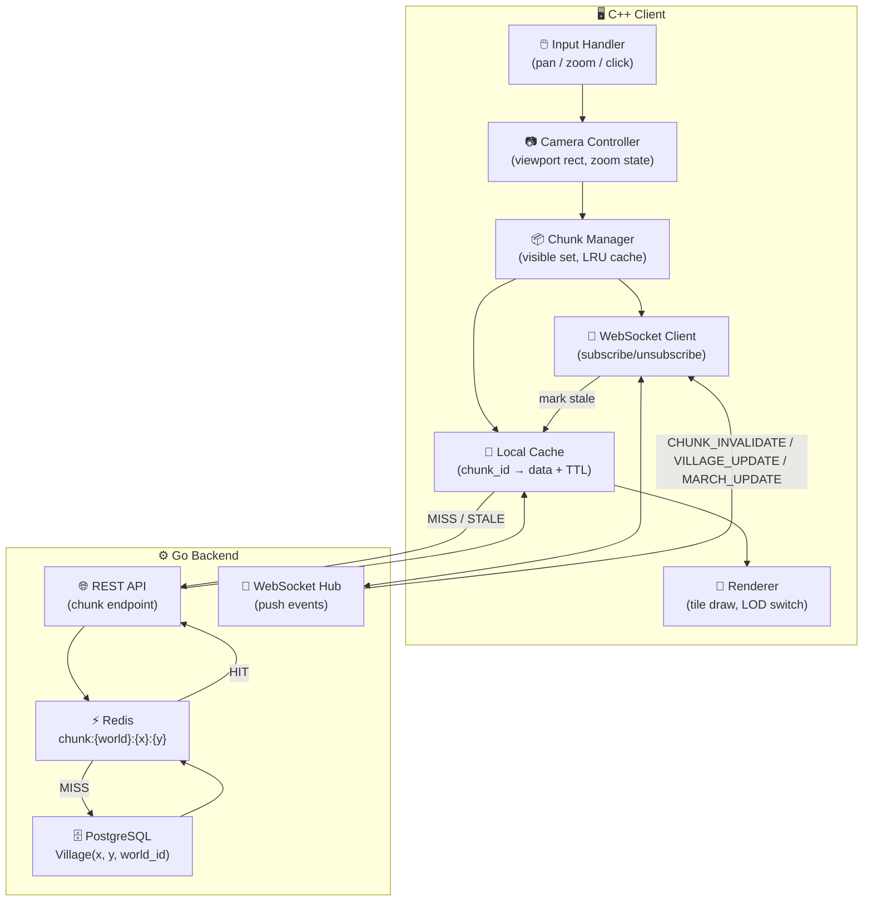
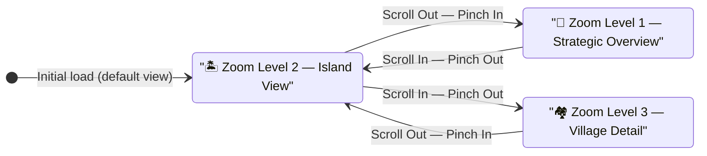
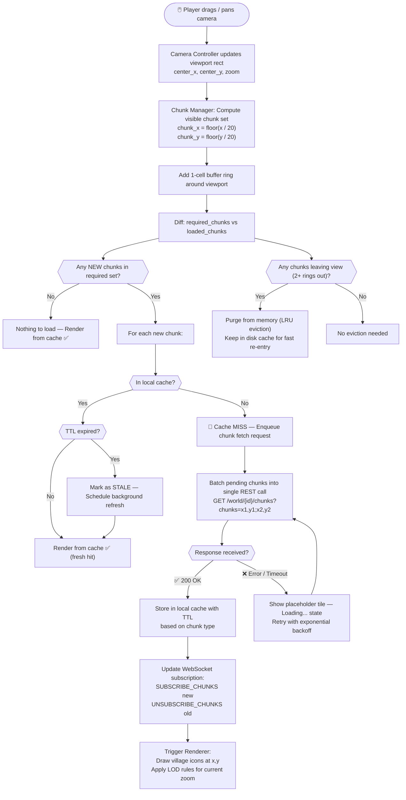
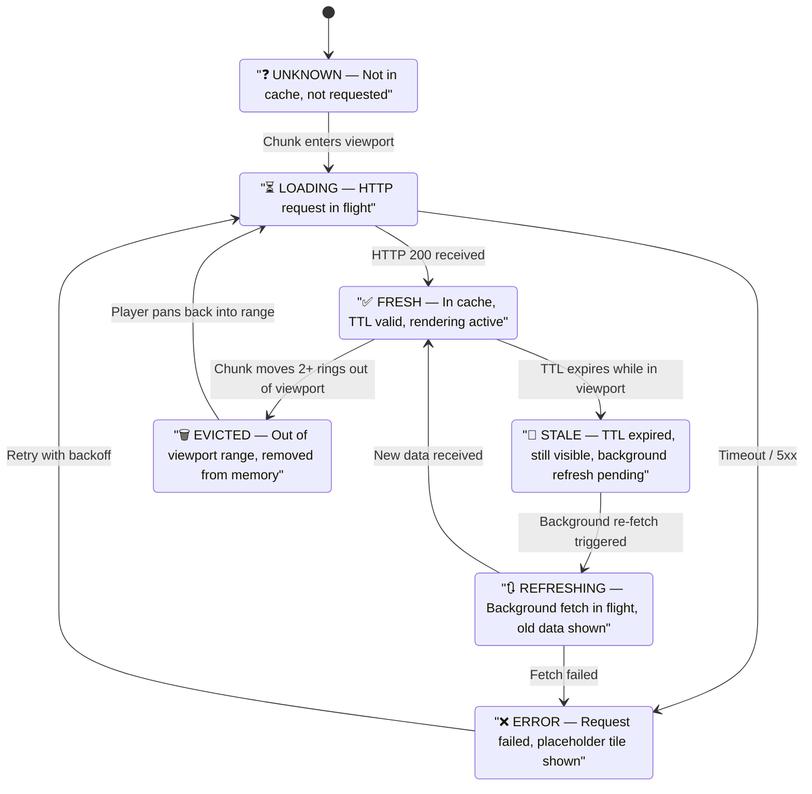
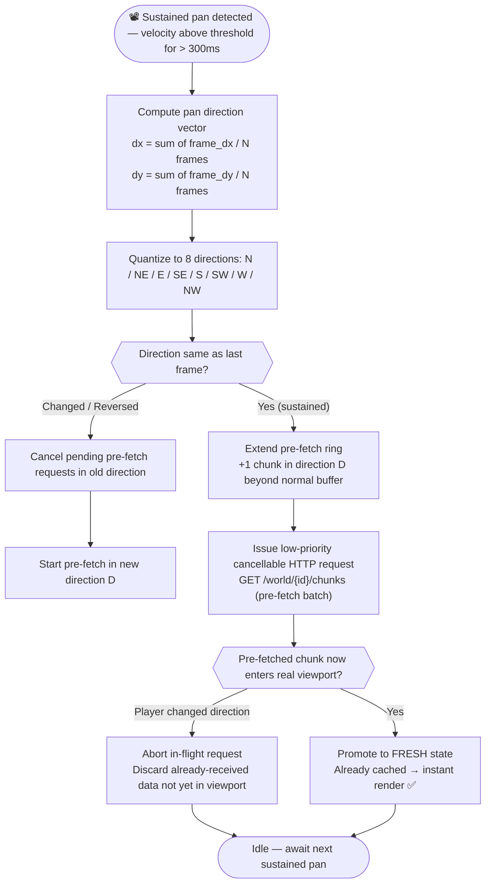
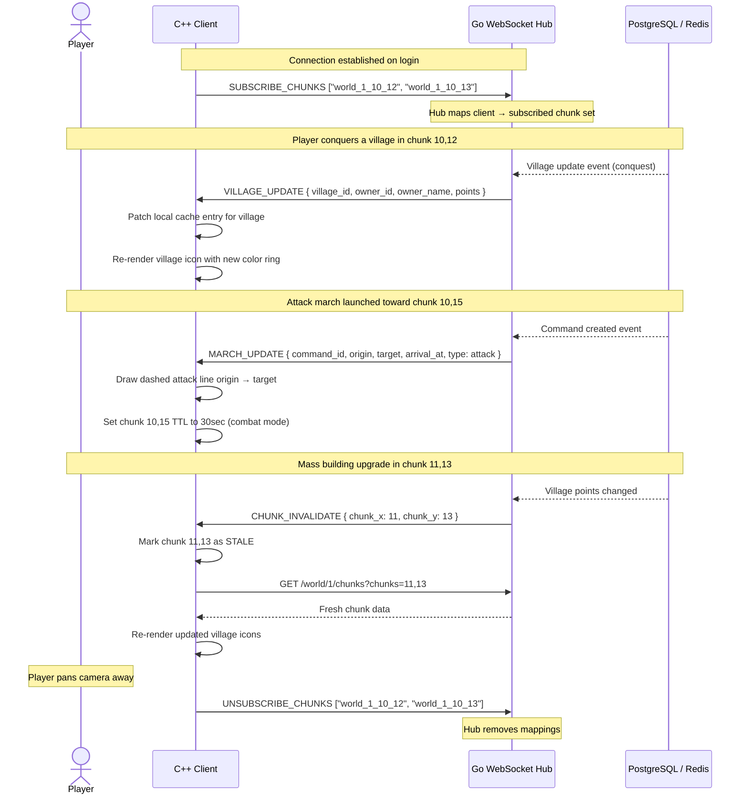
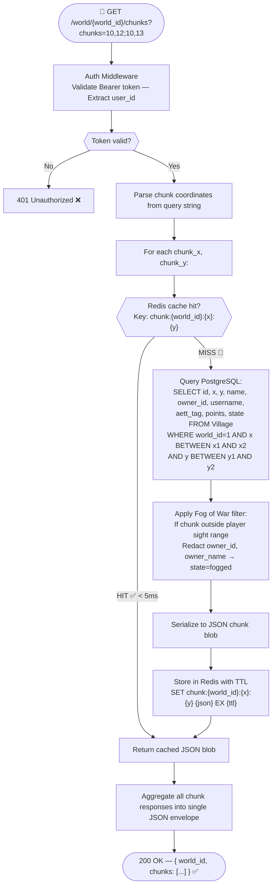
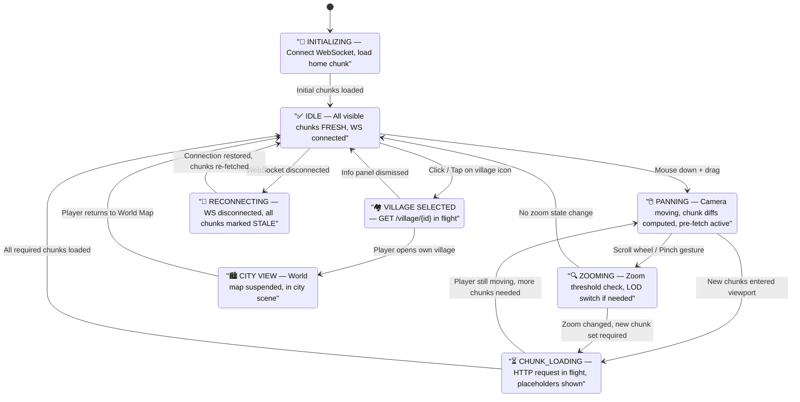

# 🗺️ Ironfrost Sagas — Map Navigation & Dynamic City Loading
## Flowcharts & Design System

> **Scope:** This document covers the complete technical flow and visual design system for the world map camera navigation and the on-demand chunk loading of cities as the player drags across the global map.
>
> **Relates to:** `World Navigation & Village Visualization.md` · GDD §8.3 World · §8.4 World View

---

## Table of Contents

1. [Overview — System Architecture](#1-overview--system-architecture)
2. [Zoom Level State Machine](#2-zoom-level-state-machine)
3. [Camera Pan → Chunk Load Flow](#3-camera-pan--chunk-load-flow)
4. [Chunk Lifecycle — Full Detail](#4-chunk-lifecycle--full-detail)
5. [Pre-fetch Direction Algorithm](#5-pre-fetch-direction-algorithm)
6. [WebSocket Real-Time Event Flow](#6-websocket-real-time-event-flow)
7. [Backend Request Pipeline](#7-backend-request-pipeline)
8. [Client-Side State Diagram](#8-client-side-state-diagram)
9. [Design System — Visual Language](#9-design-system--visual-language)
10. [LOD (Level of Detail) Rules by Zoom](#10-lod-level-of-detail-rules-by-zoom)

---

## 1. Overview — System Architecture

High-level view of all components involved when a player drags the camera.



---

## 2. Zoom Level State Machine

The map operates in three discrete zoom states. Transitioning between them changes the data density requested and the render mode.



### Zoom State Properties

| Property | Zoom L1 — Strategic | Zoom L2 — Island | Zoom L3 — Village |
|----------|:-------------------:|:----------------:|:-----------------:|
| **Shows** | Island outlines, region colors | Village icons (colored rings) | Village name, owner, points |
| **Hides** | Village icons, names | Individual stats | Full building detail |
| **Chunk TTL** | 5 min | 2 min | 30s (combat) / 2 min |
| **API payload** | Region + Island summary | Standard villages[] | villages[] + troop flag |
| **Visible chunks** | ~15×15 area | ~5×5 area | ~3×3 area |

---

## 3. Camera Pan → Chunk Load Flow

The complete decision tree from the moment the player moves the camera to when villages appear on screen.



---

## 4. Chunk Lifecycle — Full Detail

A chunk's full journey from "not yet seen" to "evicted from memory."



### TTL Reference Table

| Chunk Type | TTL | Trigger Condition |
|------------|:---:|-------------------|
| **Player's own village chunk** | 10 sec | Always fresh — player needs live data |
| **Active combat chunk** | 30 sec | Detected via WebSocket `MARCH_UPDATE` nearby |
| **Adjacent chunks** (1–2 rings) | 2 min | Default nearby state |
| **Far chunks** (3+ rings) | 10 min | Low activity expectation |
| **Zoom Level 1** (overview data) | 5 min | Coarse data, region-level aggregates |

---

## 5. Pre-fetch Direction Algorithm

When the player pans continuously in a direction, the system predicts where they're heading and pre-fetches ahead of time.



### Pre-fetch Budget

| Condition | Max Concurrent Pre-fetches | Priority |
|-----------|:--------------------------:|----------|
| Idle (no pan) | 0 | — |
| Slow pan | 2 chunks ahead | Low |
| Fast pan | 4 chunks ahead | Medium |
| Jump-to (keyboard shortcut / HUD button) | Full new viewport | High |

---

## 6. WebSocket Real-Time Event Flow

How the server pushes updates to the client without polling, and how the client reacts.



---

## 7. Backend Request Pipeline

The full server-side path for a chunk request, from REST endpoint to response.



---

## 8. Client-Side State Diagram

The full internal state of the `WorldMapState` object as the player interacts.



---

## 9. Design System — Visual Language

### 9.1 Color Tokens — Village Ownership State

| Token | Hex | Usage | Icon |
|-------|-----|-------|:----:|
| `--village-own` | `#E74C3C` | Player's own village ring | 🔴 |
| `--village-friendly` | `#2ECC71` | Aett (clan) member village | 🟢 |
| `--village-enemy` | `#3498DB` | Other player village | 🔵 |
| `--village-barbarian` | `#8D6E63` | Barbarian / NPC village | 🟤 |
| `--village-empty` | `#BDC3C7` | Open slot (no village yet) | ⚪ |
| `--village-fogged` | `#2C3E50` | Fog of war — undiscovered | ⬛ |

### 9.2 Color Tokens — Map Environment

| Token | Hex | Usage |
|-------|-----|-------|
| `--sea-base` | `#1A3A4A` | Deep sea background |
| `--sea-shallow` | `#2A6080` | Coastal / shallow water |
| `--island-land` | `#4A6741` | Temperate island landmass |
| `--island-snow` | `#D5D8DC` | Northern / tundra island overlay |
| `--island-rock` | `#7F8C8D` | Rocky coastline detail |
| `--region-border` | `#F39C12` 40% opacity | Region boundary overlay |
| `--fog-of-war` | `#0D1B2A` 80% opacity | Fog overlay above undiscovered chunks |
| `--chunk-loading` | `#1A252F` | Placeholder color while chunk fetches |

### 9.3 Aett (Clan) Dominance Overlay — Zoom L1

Aett colors are assigned at world creation and stored as HSL hue angles. The overlay is rendered as a tinted wash on the island landmass:

| State | Overlay Opacity | Border |
|-------|:---------------:|--------|
| Dominant Aett (≥75% villages) | 35% | 2px solid clan color |
| Contested (50–74%) | 20% | 1px dashed clan color |
| Majority (≥1 village) | 10% | No border |
| Barbarian-only / empty | 0% | No overlay |

### 9.4 Typography on Map

| Element | Font | Size | Weight | Zoom Visible |
|---------|------|:----:|:------:|:------------:|
| Village name | Cinzel | 11px | 400 | L3 only |
| Owner name | Inter | 10px | 400 | L3 hover only |
| Points | Inter Mono | 10px | 600 | L3 hover only |
| Island name | Cinzel | 14px | 700 | L2 + L3 |
| Region name | Cinzel | 18px | 700 | L1 only |
| HUD labels | Inter | 13px | 500 | Always |

### 9.5 Village Icon Anatomy

```
Zoom L2 + L3 — Resting State:
  ┌───────────────────────────┐
  │  [COLOR RING] 4px         │  ← ownership color from §9.1
  │  ┌──────────┐             │
  │  │ VILLAGE  │ 24×24px     │  ← static sprite
  │  │  SPRITE  │             │
  │  └──────────┘             │
  │  [⚔️ TROOP FLAG] optional  │  ← small indicator if troops present
  └───────────────────────────┘

Zoom L3 — Hover / Tap state (tooltip):
  ┌───────────────────────────┐
  │  Frostheim      [FROST]   │
  │  Thorvald                 │
  │  1,842 pts   ⚔️ troops     │
  └───────────────────────────┘
```

### 9.6 March Line Visual Rules

| Attribute | Value |
|-----------|-------|
| Line style | Dashed: 8px dash, 4px gap |
| Attack line color | `#E74C3C` (red) |
| Support line color | `#2ECC71` (green) |
| Scout line color | `#F39C12` (orange) |
| Line width | 2px |
| Arrowhead | Filled triangle, 8px |
| Appears | Immediately when `MARCH_UPDATE` received via WebSocket |
| Disappears | Immediately when march arrives or returns |
| Clipping | Lines outside viewport are clipped but tracked in memory |
| Zoom L1 | Hidden |
| Zoom L2 | Simplified (no arrowhead, 1px) |
| Zoom L3 | Full dashed line with arrowhead |

### 9.7 Chunk Placeholder Visual

| State | Visual Treatment |
|-------|-----------------|
| `LOADING` | Dark tile `#1A252F` + subtle animated shimmer gradient |
| `ERROR` | Dark tile `#1A252F` + small `⚠` icon in center, no shimmer |
| `STALE` (refreshing in background) | Full data shown at 80% opacity until refresh completes |

---

## 10. LOD (Level of Detail) Rules by Zoom

Exact render rules for each zoom state — what gets drawn, at what density, with what data.

| Data Layer | Zoom L1 (Overview) | Zoom L2 (Island) | Zoom L3 (Village Detail) |
|------------|:-----------------:|:----------------:|:------------------------:|
| Sea tiles | ✅ Full | ✅ Full | ✅ Full |
| Island landmass | ✅ Outline only | ✅ Full detail | ✅ Full detail |
| Aett dominance overlay | ✅ Rendered | ❌ Hidden | ❌ Hidden |
| Region name label | ✅ Rendered | ❌ Hidden | ❌ Hidden |
| Island name label | ❌ Hidden | ✅ Rendered | ✅ Rendered |
| Village icon sprite | ❌ Hidden | ✅ 16px icon | ✅ 24px icon |
| Village color ring | ❌ Hidden | ✅ 2px thin | ✅ 4px full |
| Village name | ❌ Hidden | ❌ Hidden | ✅ On hover/tap |
| Owner name | ❌ Hidden | ❌ Hidden | ✅ On hover/tap |
| Point total | ❌ Hidden | ❌ Hidden | ✅ On hover/tap |
| Troop indicator | ❌ Hidden | ❌ Hidden | ✅ Small icon |
| March lines | ❌ Hidden | ✅ Simplified 1px | ✅ Full dashed + arrow |
| Fog of War overlay | ✅ Full | ✅ Full | ✅ Full |
| Empty slot markers | ❌ Hidden | ✅ Small dot | ✅ Full ⚪ marker |

### LOD Chunk Memory Profile

| Zoom | Chunks Visible | + Buffer Ring | Total in Memory | Est. Memory |
|------|:--------------:|:-------------:|:---------------:|:-----------:|
| L1 (Overview) | ~225 chunks | +56 | ~289 chunks | ~8.7 MB |
| L2 (Island) | ~25 chunks | +16 | ~49 chunks | ~9.8 MB |
| L3 (Village) | ~9 chunks | +16 | ~25 chunks | ~5.0 MB |

> **Note:** At Zoom L1, the API returns lightweight **region/island summary data** — not full village lists. Payload is ~1–5KB per region vs ~30KB per village chunk. The client switches the API endpoint automatically based on zoom state.

---

## Appendix A — Chunk Coordinate Quick Reference

```
Chunk size:    20 × 20 grid cells
World size:    500 × 500 cells (MVP)
Total chunks:  25 × 25 = 625 chunks

chunk_x = floor(village_x / 20)    → range [0..24]
chunk_y = floor(village_y / 20)    → range [0..24]

Cache key format (Redis):
  chunk:{world_id}:{chunk_x}:{chunk_y}
  Example: "chunk:abc123:10:12"

WebSocket subscription ID:
  "world_abc123_10_12"

REST API query format:
  GET /world/abc123/chunks?chunks=10,12;10,13;11,12
```

---

## Appendix B — Implementation Checklist

### C++ Client

- [ ] `InputHandler` → detect drag start, velocity, direction
- [ ] `CameraController` → viewport rect, zoom state enum, clamp to world bounds
- [ ] `ChunkManager` → required_chunks diff, cache map, LRU eviction
- [ ] `ChunkCache` → TTL logic, FRESH/STALE/LOADING/ERROR states
- [ ] `HttpClient` → batch chunk request, cancellable, exponential backoff
- [ ] `WebSocketClient` → subscribe/unsubscribe, event dispatch
- [ ] `Renderer` → LOD switch by zoom, village sprite draw, march line draw, fog overlay
- [ ] `PrefetchEngine` → direction quantization, pre-fetch ring extension, cancel logic

### Go Backend

- [ ] `GET /world/{id}/chunks` endpoint with multi-chunk batching
- [ ] Redis chunk cache layer with TTL per chunk type
- [ ] PostgreSQL spatial index on `(world_id, x, y)`
- [ ] WebSocket hub with chunk subscription map per connected client
- [ ] Fog of War filtering middleware (redact owner data for unscouted chunks)
- [ ] Chunk invalidation on `Village UPDATE` → Redis key delete + WS `CHUNK_INVALIDATE`
